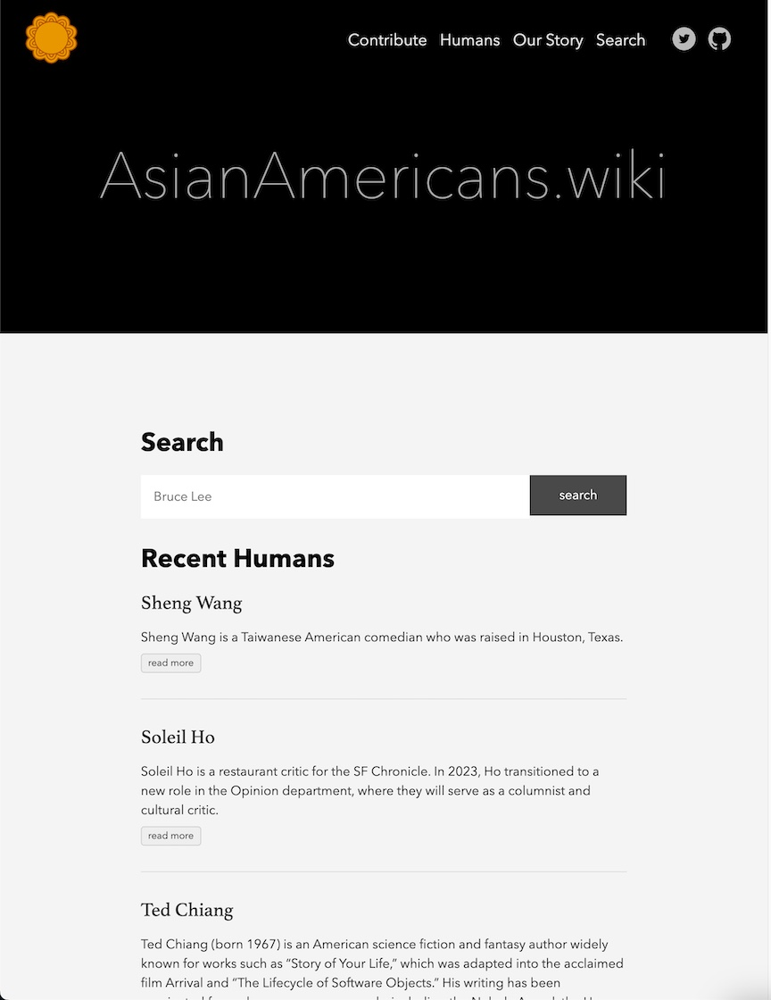
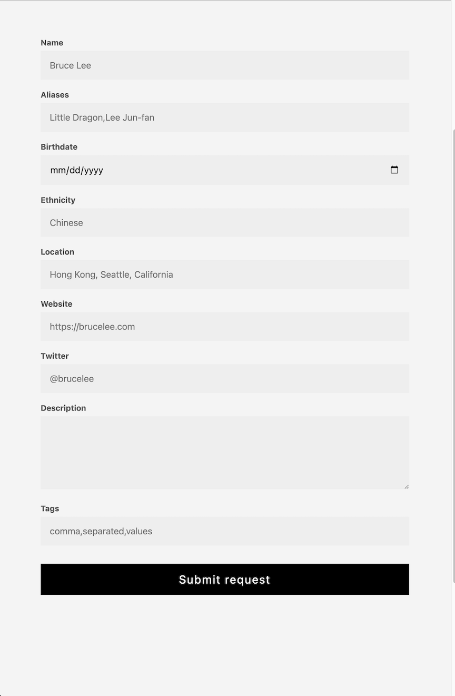

In this post I'll talk about the technology behind AsianAmericans.wiki and how I plan on evolving it over time.

Screenshot of AsianAmericans.wiki today:

# Background

AsianAmericans.wiki is a website where you can go to learn more about famous Asian Americans (and non Americans too). When I first built the site, I wanted something that I could prototype quickly. Since the site allows contributions, I needed something that allows for auditing. It was going to be mostly static, so I didn't want to pay for running a server 24/7. I also wanted it to be very, very fast. Lastly, I wanted it to be discoverable, allowing more people to find it easily. So let's see, my four requirements were:

1. Audit-able
2. Low cost
3. Performant
4. SEO friendly

And based on these requirements, I narrowed it down to two options:

1. Build it myself.
2. Use something off the shelf.

I didn't want to build everything myself, because by the time I would have built it in the way that I wanted, with my skill set, it would've taken months. It would've required a ton of learning front-end skills and struggling with CSS before I could get something usable out the door.

Enter Hugo. Hugo is a static site generator, and it hit all of the requirements that I was looking for.

**Auditable**: Because AsianAmericans.wiki was open source anyways, Git was the natural solution to track who made changes to which entries at what time. Auditing was built into the source control system itself. Anyone that was familiar with Git is able to contribute to the website.

**Low cost**: At the end of the day, Hugo generates a set of HTML, CSS, and JS files that you can deploy to a CDN of your choice. This literally made it free to run because I never exceeded the data transfer costs on Firebase hosting.

**Performance**: I also get the benefit of deploying to a CDN, which means that the data served is extremely close to wherever the users are. And since there's no servers involved, all of the data can be served from the CDN directly.

**SEO**: Because all pages are generated at build time, and nothing is dynamically fetched, SEO benefits from this. Lighthouse scores were 99/100/100/91 at the time of this writing.

# Making Everything Work

Unfortunately, Hugo couldn't do everything out the box for me, and there was a lot of unwanted tweaking necessary to make things work.

### Search

The first was that I wanted a search feature. But how does one build a search feature into a static site? I ended up using a common Hugo solution for search, which is to build a search index at build time. This is essentially some JSON that we build using all of the available markdown files as source. Then, we can inject the json into the search page, where some client side Javascript will run to search against. It turns out, this was sufficient, and also highly performant. And it was completely free too. But it near impossible to customize, and to understand what users were searching for.

### Twitter Integration

I also had this idea of creating a [Twitter account](https://twitter.com/aapiwiki). It's powered by a bot that follows the people who are submitted to the website. Normally, this would be something that happens in the backend. The server would receive a request that a new person was contributed to the site, and fire off an event that would have the bot invoke the Twitter API to follow that person submitted.

But because this is JAM stack, I had to get creative. I ended up writing a Go program that scans the entire set of Markdown files (the M in JAM) to extract the twitter handle from the markdown front matter. From there, I could perform a diff to find who needed to be followed or un-followed using Twitter's API. To automate it, I built it as a Github Action, so that whenever any markdown file was modified, the action would run and fire off the Twitter bot. This worked, was naturally event sourced, and was good enough to go to production with.

### Contribution Form

Another aspect that I needed to build was some API that would accept contributions to the site. I know that not every one is a Git user and isn't familiar with writing Markdown, so I needed to build a user friendly way to perform this task. Again, I didn't want to build a whole server for something that would receive at most 100 requests per day, so I decided to go Serverless. I used Google Cloud Functions to deploy a Go handler that would accept this contribution, and submit a Github Pull request on behalf of the user. That's what powers the [contribution page](https://asianamericans.wiki/contribute/) as of this writing.

It's important to note that all of these techniques may not necessarily scale if you're building the next Instagram, TikTok, or whatever. But I wasn't building that. What I prioritized was time to market, being able to get something out quickly and proving that it worked was more important that building the most scalable solution. It was important to consider that the upper bounds I was working with was in the hundreds or thousands, instead of millions and beyond.

# Future work

I'm currently in the process of migrating the the website into a more full fledged application. I've always wanted to make AsianAmericans.wiki feel a bit more dynamic, allows users to log in, save, contribute, and gain ownership of how they use the app. And in order to support all of the features, I thought it would make sense to rewrite and restructure the architecture of AsianAmericans.wiki. While it may be possible to achieve the features I want using Hugo, I think restructuring it now would make it easier to evolve in the future. This includes bringing in a datastore to persist user-specific data, Cloud Functions to make things server-rendered to be SEO friendly and performant, and Algolia for fast index-based searches. It includes rewriting the entire UI in SvelteJS to make it truly customizable, and to have a development-friendly environment. Writing UI components is SvelteJS is much nicer than working HTML template files in Go.

Overall, I'm excited for this change and I hope that it'll bring more users to the site.

# Conclusion

Hugo was able to power my site for over two years in production with zero downtime. Everything worked the way it was supposed to, and without any major headaches. However, as my vision for the site continues to evolve, so should the technology powering it. I'm excited for the growth of AsianAmericans.wiki in the years to come!
